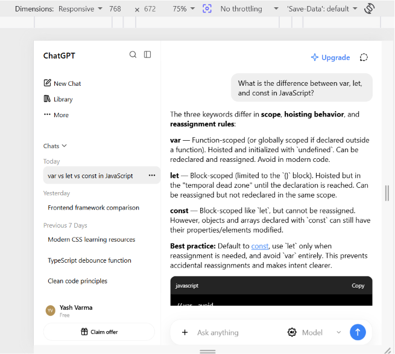
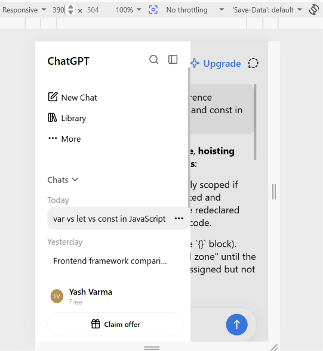
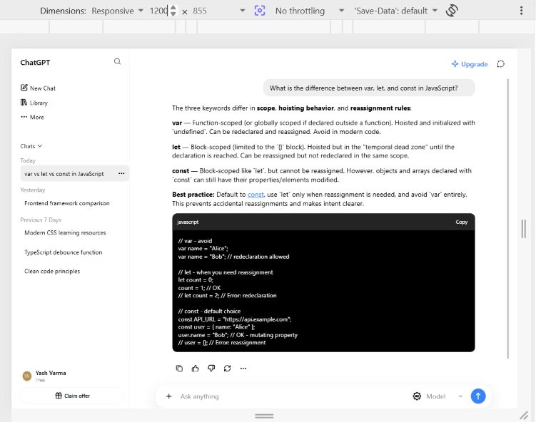
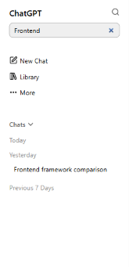
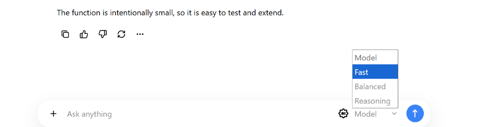
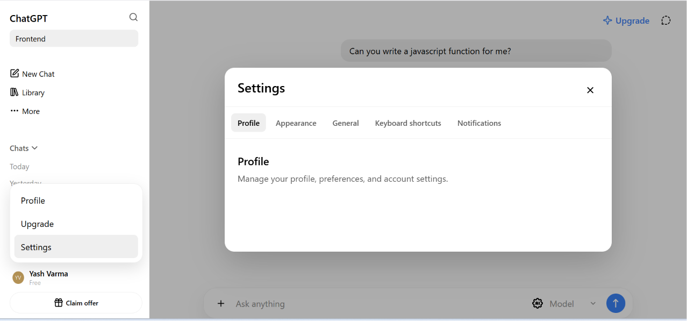
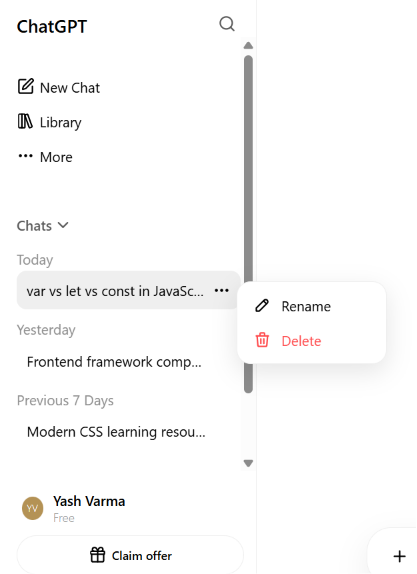
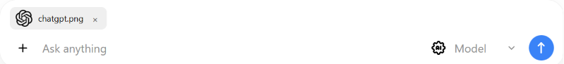

# ChatGPT Clone

A responsive ChatGPT Web interface built with HTML, SCSS, and SCSS JavaScript.

## Project Structure

```

├── index.html              
├── scss/
│   ├── main.scss           
│   ├── abstracts/          
│   │   ├── _variables.scss 
│   │   ├── _mixins.scss    
│   │   ├── _functions.scss 
│   │   └── _index.scss     
│   ├── base/               
│   │   ├── _reset.scss
│   │   ├── _typography.scss
│   │   └── _global.scss
│   ├── layout/             
│   │   ├── _sidebar.scss
│   │   └── _chat.scss
│   └── components/         
│       ├── _message.scss
│       ├── _modal.scss
│       ├── _code-block.scss
│       ├── _table.scss
│       └── _attachment.scss
├── js/
│   ├── main.js             
│   ├── components/         
│   │   ├── sidebar.js      
│   │   ├── chat.js         
│   │   ├── message.js      
│   │   ├── modal.js        
│   │   └── attachment.js   
│   └── data/
│       ├── conversations.js 
│       └── responses.js     
├── css/
│   └── main.css            
└── assets/
    ├── icons/              
    ├── images/
    └── fonts/
```


## JavaScript Structure

| File | Responsibility |
|------|----------------|
| `sidebar.js` | Sidebar open/close, dark overlay, search filter, conversation context menu (rename/delete) |
| `chat.js` | Auto-resize textarea, user request & response, send/stop generation, welcome screen, prompt suggestions, message actions (copy, like/dislike, regenerate, more) |
| `message.js` | `text` → paragraphs + headings + **bold** + [links](url); `list` → `<ul>/<ol>`; `table` → markdown table parsing; `code` → code block with copy button |
| `modal.js` | Settings Modal |
| `attachment.js` | File input trigger, preview (image thumbnail or filename), clear |

**Data layer** (`js/data/`) is intentionally separate:
- `conversations.js` — Full conversation objects (role + structured content blocks) keyed by ID (`text`, `table`, `links`, `code`, `lists`). Also holds the three prompt suggestions.
- `responses.js` — Keyword-based mock responder (`pickResponse(text)`) + regeneration variants. No network calls.

## Key Implementation Decisions

- **Structured message content** — Instead of raw markdown strings, assistant messages are arrays of typed blocks (`{ type: 'text', value: '...' }`, `{ type: 'code', language: 'ts', value: '...' }`). `message.js` handles each type with a focused function.

- **Overlay, Modal, Chat Area, Sidebar z-index handling** — Z-index simplicity; backdrop click + close button + settings modal + Sidebar.

## Known Limitations

- **No real API** — Responses are static mock data. Streaming, tool use, and conversation context are not implemented.
- **No persistence** — Refresh loses everything (conversation history, settings, active chat).
- **Model selector is decorative** — Changes nothing; no model parameter passed to responder.
- **Code blocks lack syntax highlighting** — Only language label + monospace.
- **Static Mock Response** - The response for showcasing tables, code, lists, links are static & application don't have the dynamic response generation like that.

## Application Interface Screenshots








